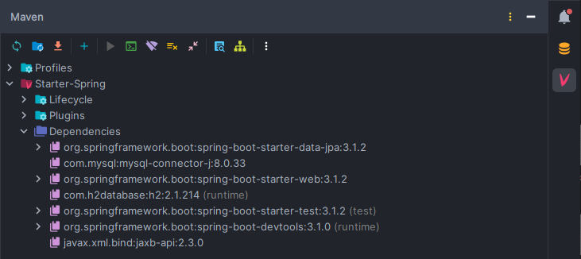

# Starter Spring

## What is Spring?
According to the documentation, Spring is a framework designed for businesses using Java within their environments. In simpler terms, Spring is a substantial open-source Java framework designed for various projects. As explained in the Spring documentation, the framework offers fundamental assistance for diverse application structures, such as messaging, transactional data, persistence, and web development. It also incorporates the Servlet-based Spring MVC web framework and, in tandem, the Spring WebFlux reactive web framework.

## Getting Started with Spring
When venturing into the realm of Spring, it's essential to begin with a solid foundation. Here are some beginner-friendly resources that can help you grasp the basics:

- Official Spring Documentation:
  - [Documentation](https://docs.spring.io/spring-framework/reference/index.html)
  - [Dev Tools](https://docs.spring.io/spring-boot/docs/1.5.16.RELEASE/reference/html/using-boot-devtools.html)
- YouTube Tutorials:
  - [Starting with Spring](https://www.youtube.com/watch?v=9SGDpanrc8U)
- Udemy Course: 
  - [Hibernate and Spring JPA, beginner to guru](https://www.udemy.com/course/hibernate-and-spring-data-jpa-beginner-to-guru/)
- _Folder Structure (optional)_:
  - [Structure](https://studygyaan.com/spring-boot/spring-boot-project-folder-structure-and-best-practices)

_(Note: The content here is primarily for personal note-taking purposes. If you're seeking a step-by-step guide, you might need to refer to additional resources.)_


## How to Start with a Maven Spring Project
### Requirements
 - Java Development Kit (JDK) installed on your system
 - A text editor or IDE of your choice (e.g., IntelliJ IDEA, Eclipse)
 - Maven installed on your system (optional with IntelliJ)
 - MySQL installed (follow the MySQL installation script below)
 - Angular CLI installed (for the frontend; follow the (["Starter-Angular"](https://github.com/FireNick44/Starter-Angular) guide)
 - _Postman (for testing APIs) (optional)_
 - Understanding the Java basics ([cheat sheet](/javaBasics.md))

> I would recommend IntelliJ ;)

#### Maven installation
Download Maven: [here](https://maven.apache.org/download.cgi)
#### MySQL installation
Download MySQL: [here](https://dev.mysql.com/downloads/)


## Starting with Packages

 - There is no "package" file, all packages/plugins are stored in the pom.xml _(inside of the root folder)_
   _that is due to maven (a build tool that creates a XML based configuation file (the pom.xml))_
 
 - Depending on the way you initialize your Spring project, the connection to packages and plugins is established through either Maven or Gradle. In this project, I've chosen to use Maven. Notably, IntelliJ also provides seamless integration with Maven, offering error indications for missing modules and enhancing your development experience. Here's a visual representation of Maven's integration in IntelliJ:

<p align="center">
   
</p>

 - For accessing the entire collection of packages, the official Maven repository is a valuable resource. You can explore and find the packages you need at: https://repo.maven.apache.org/maven2/

### Live Refresh
There isn't a "npm run dev" equivalent, and without the development tool, "live refresh" isn't achievable. _(It still only works for changes in one class, but at leat that...)_ This is why we need to install it. While you could have done this at the start, it's also beneficial as a practice for installing "packages".

1. Open the src/main/resources/application.properties file, which works specifically in a Maven project.
2. Paste the following snippet within the <dependencies> section:

```xml
<dependency>
    <groupId>org.springframework.boot</groupId>
    <artifactId>spring-boot-starter-devtools</artifactId>
    <scope>runtime</scope>
</dependency>
```
This ensures that live refresh becomes possible.

- Remember, when specifying dependencies in your pom.xml, they can include version tags or be marked as optional, based on your specific needs.

| Scope         | Description                                                                                              | Use Case                                  | What It Does                                                      |
|---------------|----------------------------------------------------------------------------------------------------------|--------------------------------------------|-------------------------------------------------------------------|
| compile       | Default scope. Dependencies are available during compilation and at runtime.                         | Project dependencies                    | Included in classpath for compilation and runtime.                |
| provided      | Dependencies are expected to be provided by the runtime environment (e.g., servlet container).       | Server-provided libraries               | Available for compilation but not packaged with the application.  |
| runtime       | Dependencies are needed at runtime but not during compilation.                                       | JDBC drivers, plugins                   | Included in classpath for runtime, not used during compilation.   |
| test          | Dependencies needed only for testing.                                                                 | Testing libraries                        | Available for testing but not in the runtime application.         |
| system        | Dependencies are not retrieved from a repository, but from the local system.                        | Non-Maven local JARs                    | Allows you to specify system path for a dependency.             |
| import        | Used only in a dependencyManagement section to manage versions of transitive dependencies.          | Centralized dependency version control | Provides version constraints for transitive dependencies.        |
| compileOnly   | Introduced by Gradle. Similar to provided scope; dependencies are used during compilation but not packaged. | Provided but not runtime dependencies | Similar to provided scope in Maven. Not available in all tools.  |
| optional      | Dependencies that are not required for the main functionality of the project.                       | Optional extensions or plugins          | Indicate that a dependency is optional and won't cause failures. |

## Starting with application.properites
Unlike some setups that use a `.env` file for storing sensitive information, Spring projects follow a different approach. The equivalent here is the `application.properties` file, where you can manage configurations, including passwords and other crucial details.

```
# Devtool -> live reload
spring.devtools.livereload.enabled=true

# just an example, this could be something else depending on what DB you use
spring.datasource.url=jdbc:mysql://localhost:3306/YOUR_DATABASE_NAME

# DB login:
spring.datasource.username=YOUR_USERNAME
spring.datasource.password=YOUR_PASSWORD

# This is to adjust the DB accordingly to spring
spring.jpa.show-sql=true
spring.jpa.hibernate.ddl-auto=update
spring.jpa.properties.hibernate.dialect=org.hibernate.dialect.MySQL8Dialect
```

important depending on what you use, those value change.
I used a tutrial and realised the tutorial used a older version of mySQL:
```
spring.jpa.properties.hibernate.dialect=org.hibernate.dialect.MySQL5Dialect
```
insted of:
```
spring.jpa.properties.hibernate.dialect=org.hibernate.dialect.MySQL8Dialect
```